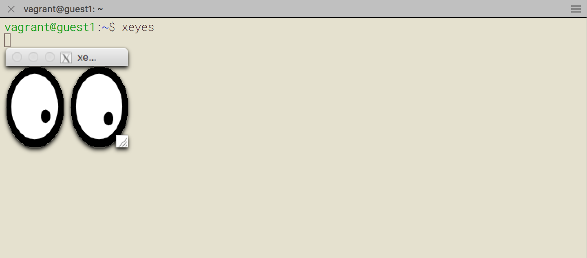
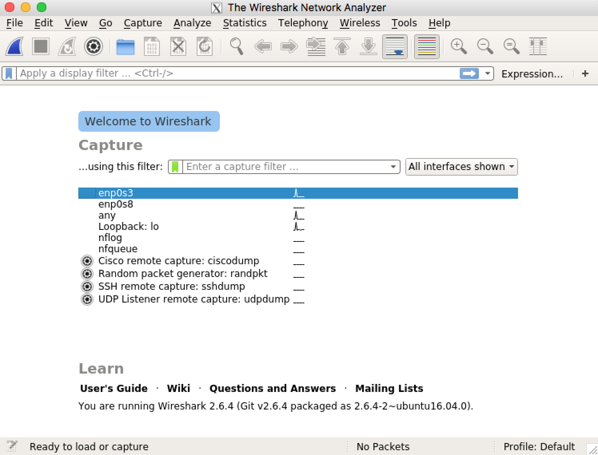

# サポートページ

xxxのサポートページです．

## 環境構築

本書では，VirtualBoxとVagrantとX Serverを組み合わせてシミュレーション環境を構築します．以下では，そのセットアップ方法を説明します．

### 検証環境

以下の環境で動作を確認しました．基本的に仮想マシン上でシミュレーションを行いますので，下記のVirtualBoxとVagrantとX Serverの環境が構築できれば，macOS以外の環境でも問題なく実行できるはずです．

- OS: macOS Mojave, 10.14.3
- プロセッサ: 2.9 GHz Intel Core i7
- メモリ: 16GB 2133 MHz LPDDR3
- VirtualBox: 6.0.4r128413
- Vagrant: 2.2.4

VirtualBoxでは以下のような環境で仮想マシンを立ち上げ，動作を確認しました．

- Ubuntu: 16.04
- WireShark: 2.6.5
- ns-3: 3.27
- python: 3.5.2
- gcc: 5.4.0
- make: 4.1

なお，2019年4月1日現在，ns-3のインストールガイドがUbuntu 18.04に対応していないため，本書ではUbuntu 16.04を採用します．また，2019年4月1日現在，5章や6章で利用するCUBICやBBRのモジュールがns-3.28以上に対応していないため，本書ではn-3.27を利用します．

4GBのメモリを搭載した仮想マシンを起動するため，それ以上のメモリを積んだ物理マシンをご用意頂く必要があることにご注意ください．

### Oracle VM VirtualBox

2019年4月1日現在，VirtualBoxは[Webサイト](https://www.virtualbox.org/)の`Download`ページから，ホストOSに対応したインストールパッケージをダウンロードすることができます．インストーラを起動すれば，VirtualBoxをインストールできます．

macOSの場合は，ターミナルソフトウェア（例えばターミナルなど）で以下のコマンドを実行して，バージョンが表示されれば，VirtualBoxのインストールが完了していることが確認できます．お手元の環境によって，表示されるバージョンが異なる可能性がありますのでご注意ください．

```shell
$ VBoxManage -v
> 6.0.4r128413
```

### Vagrant

2019年4月1日現在，Vagrantの[Webサイト](https://www.vagrantup.com/)の`Download`ボタンをクリックすると，インストールパッケージのダウンロード画面に遷移します．お手元の環境に対応したパッケージを選択し，ダウンロードが終わったらインストーラを実行しましょう．

macOSの場合は，ターミナルソフトウェア（例えばターミナルなど）で以下のコマンドを実行して，バージョンが表示されれば，Vagrantのインストールが完了していることが確認できます．お手元の環境によって，表示されるバージョンが異なる可能性がありますのでご注意ください．

```shell
$ vagrant -v
> Vagrant 2.2.4
```

### X server

本書では，ゲストOS上のWireSharkをX window system経由で操作しますので，ホストOS上でX serverの環境を構築する必要があります．

2019年4月1日現在，macOS X Sierraの場合は，[XQuartzプロジェクト](https://www.xquartz.org/)からX11サーバを入手できます．他のOSをお使いの場合は，対応が異なりますのでご注意ください．

X serverの動作を確認するため，仮想マシン上のGUIアプリケーションを起動してみましょう．まず，ダウンロードした本書のソースコードディレクトリの`wireshark/vagrant/`に移動し，以下のコマンドを実行してください．

```shell
$ vagrant up
```

4章で利用するWireSharkの仮想環境が立ち上がります（しばらく時間がかかることがあります）．以下のコマンドでSSH接続し，`xeyes`を起動してみましょう．

```shell
$ vagrant ssh guest1

> Welcome to Ubuntu 16.04.5 LTS (GNU/Linux 4.4.0-139-generic x86_64)
>
> * Documentation:  https://help.ubuntu.com
> * Management:     https://landscape.canonical.com
> * Support:        https://ubuntu.com/advantage
>
> Get cloud support with Ubuntu Advantage Cloud Guest:
> http://www.ubuntu.com/business/services/cloud
>
> 0 packages can be updated.
> 0 updates are security updates.
>
> New release '18.04.1 LTS' available.
> Run 'do-release-upgrade' to upgrade to it.

vagrant@guest1:~$ xeyes
```

以下のように二つの目玉が表示されることを確認しましょう．



一旦ログアウトして，仮想マシンを停止しましょう．

```shell
vagrant@guest1:~$ exit
$ vagrant halt
```

## シミュレーション環境の確認

本書では，WireSharkおよびns3でシミュレーションを行います．以下では，正しく環境を構築できているか確認します．

### WireShark

VirtualBox，VagrantおよびX serverの環境構築が済んでいることを確認したら，[このGitHubレポジトリ](https://github.com/neko9laboratories/tcp-book)を任意のディレクトリにクローンしましょう．`wireshark/vagrant`ディレクトリに移動し，`vagrant up`を実行します．これで，2台の仮想マシン上にUbunut 16.04環境が構築されます．

```shell
$ git clone https://github.com/neko9laboratories/tcp-book.git
$ cd tcp-book/wireshark/vagrant
$ vagrant up
```

以下のコマンドでゲストOSにSSH接続しましょう．ログインメッセージが表示され，プロンプトが`vagrant@guest1:~$`に変わります．

```shell
$ vagrant ssh guest1

> Welcome to Ubuntu 16.04.5 LTS (GNU/Linux 4.4.0-139-generic x86_64)
>
> * Documentation:  https://help.ubuntu.com
> * Management:     https://landscape.canonical.com
> * Support:        https://ubuntu.com/advantage
>
> Get cloud support with Ubuntu Advantage Cloud Guest:
> http://www.ubuntu.com/business/services/cloud
>
> 0 packages can be updated.
> 0 updates are security updates.
>
> New release '18.04.1 LTS' available.
> Run 'do-release-upgrade' to upgrade to it.

vagrant@guest1:~$
```

WireSharkを起動してみましょう．

```shell
vagrant@guest1:~$ wireshark
```



図4.18のようにWireSharkが起動することを確認したら，準備は完了です．一旦ログアウトして，仮想マシンを停止しましょう．

```shell
vagrant@guest1:~$ exit
$ vagrant halt
```

### ns3

VirtualBoxおよびVagrantのインストールが済んでいることを確認したら，[このGitHubレポジトリ](https://github.com/neko9laboratories/tcp-book)を任意のディレクトリにクローンしましょう．`ns3/vagrant`ディレクトリに移動し，`vagrant up`を実行します．これで，仮想マシン上でUbunut 16.04が立ち上がり，ns-3の環境構築が実行されます．なお，2019年4月1日現在，5章や6章で利用するCUBICやBBRのモジュールがns-3.28以上に対応していないため，本書ではn-3.27を利用します．ns-3の環境構築にはしばらく時間がかかりますので，気長にお待ち下さい．

```shell
$ git clone https://github.com/neko9laboratories/tcp-book.git
$ cd tcp-book/ns3/vagrant
$ vagrant up
```

ゲストOSにSSH接続しましょう．

```shell
$ vagrant ssh
> Welcome to Ubuntu 16.04.5 LTS (GNU/Linux 4.4.0-139-generic x86_64)
>
>  * Documentation:  https://help.ubuntu.com
>  * Management:     https://landscape.canonical.com
>  * Support:        https://ubuntu.com/advantage
>
>   Get cloud support with Ubuntu Advantage Cloud Guest:
>     http://www.ubuntu.com/business/services/cloud
>
> 13 packages can be updated.
> 6 updates are security updates.
>
> New release '18.04.1 LTS' available.
> Run 'do-release-upgrade' to upgrade to it.
>
>
vagrant@ubuntu-xenial:~$
```

上記のようにプロンプトが`vagrant@ubuntu-xenial:~$`に変わったら，SSH接続成功です．

## 正誤表

## About us

[特定非営利活動法人 neko 9 Laboratories](https://www.neko9.org/)は，情報通信および情報処理に関する研究開発事業を通じて，学術の振興に寄与することを目的としています．

（著者一覧的なものを書きたい）

info[at]neko9.org
